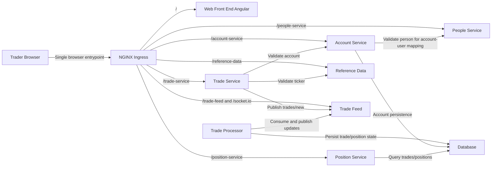

# Architecture (State 003 Containerized Compose Runtime)

State 003 preserves state 002 routing semantics while moving runtime to Docker Compose and NGINX ingress.

- Inherits architectural baseline from: `002-edge-proxy-uncontainerized`
- Generated from: `system/architecture.model.json`
- Canonical flows: `../001-baseline-uncontainerized-parity/system/end-to-end-flows.md`

## Entry Points

- `ingress`: `http://localhost:8080`
- `angular-debug`: `http://localhost:18093`

## Architecture Diagram

## Node Catalog

| Node | Kind | Label | Notes |
| --- | --- | --- | --- |
| `trader` | actor | Trader Browser | User traffic enters through ingress. |
| `ingress` | gateway | NGINX Ingress | Compose ingress for UI/API/WebSocket routes. |
| `web` | frontend | Web Front End Angular | Containerized Angular service. |
| `account` | service | Account Service | Containerized Spring service. |
| `position` | service | Position Service | Containerized Spring service. |
| `tradeService` | service | Trade Service | Containerized Spring service. |
| `referenceData` | service | Reference Data | Containerized Node service. |
| `people` | service | People Service | Containerized .NET service. |
| `tradeFeed` | messaging | Trade Feed | Containerized Socket.IO bus. |
| `tradeProcessor` | service | Trade Processor | Containerized Spring service. |
| `database` | database | Database | Containerized H2 persistence service. |

## State Notes

- State 003 preserves approved baseline functional behavior while changing runtime/ops model.
- Inter-service network resolution uses Docker Compose service DNS names.

