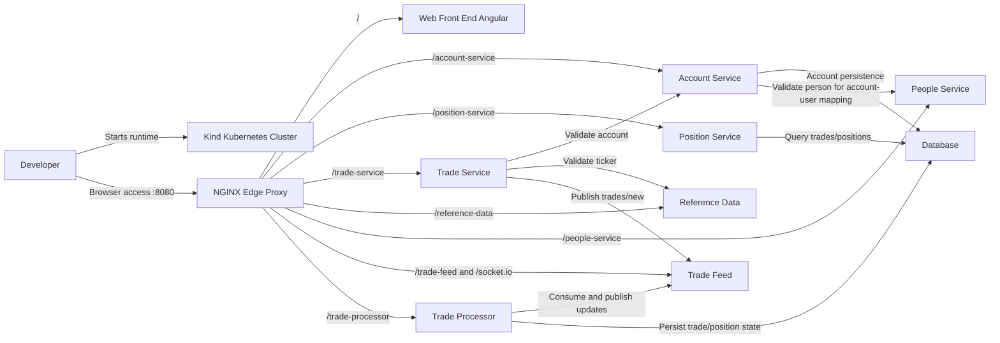

# Architecture (State 004 Kubernetes Runtime)

State 004 preserves state 003 browser/API routing behavior while running all services on a local Kubernetes cluster.

- Inherits architectural baseline from: `003-containerized-compose-runtime`
- Generated from: `system/architecture.model.json`
- Canonical flows: `../001-baseline-uncontainerized-parity/system/end-to-end-flows.md`

## Entry Points

- `edge-proxy`: `http://localhost:8080`
- `edge-health`: `http://localhost:8080/health`

## Architecture Diagram

## Node Catalog

| Node | Kind | Label | Notes |
| --- | --- | --- | --- |
| `developer` | actor | Developer | Runs local Kind-based Kubernetes runtime. |
| `cluster` | boundary | Kind Kubernetes Cluster | Local cluster namespace and workloads. |
| `edge` | gateway | NGINX Edge Proxy | Single browser entrypoint for UI/API/WebSocket routes. |
| `web` | frontend | Web Front End Angular | Angular frontend served behind edge proxy. |
| `account` | service | Account Service | Account and account-user APIs. |
| `position` | service | Position Service | Positions and trades query API. |
| `tradeService` | service | Trade Service | Trade order submission and validation. |
| `referenceData` | service | Reference Data | Ticker metadata lookup. |
| `people` | service | People Service | Person lookup and matching APIs. |
| `tradeFeed` | messaging | Trade Feed | Socket.IO event bus for trade flows. |
| `tradeProcessor` | service | Trade Processor | Consumes trade events and persists settled state. |
| `database` | database | Database | H2 persistence service. |

## State Notes

- Functional behavior remains intentionally equivalent to state 003.
- Primary delta is runtime/operations model (Compose to Kubernetes).
- Edge proxy remains NGINX-based to keep route semantics stable.

