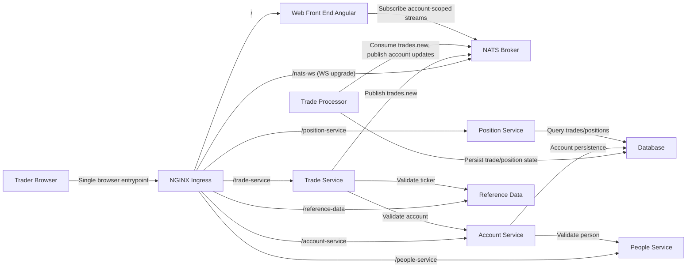

# Architecture (State 007 Messaging NATS Replacement)

State 007 replaces Socket.IO trade-feed messaging with NATS while preserving state 003 containerized runtime and ingress entry model.

- Inherits architectural baseline from: `003-containerized-compose-runtime`
- Generated from: `system/architecture.model.json`
- Canonical flows: `../001-baseline-uncontainerized-parity/system/end-to-end-flows.md`

## Entry Points

- `ingress`: `http://localhost:8080`
- `nats-ws`: `ws://localhost:8080/nats-ws`

## Architecture Diagram

## Node Catalog

| Node | Kind | Label | Notes |
| --- | --- | --- | --- |
| `trader` | actor | Trader Browser | Uses Angular UI and receives live updates. |
| `ingress` | gateway | NGINX Ingress | Routes REST and websocket traffic. |
| `web` | frontend | Web Front End Angular | Uses nats.ws for account-scoped streams. |
| `nats` | messaging | NATS Broker | Core pub/sub broker for backend and browser streaming. |
| `tradeService` | service | Trade Service | Publishes new trade events. |
| `tradeProcessor` | service | Trade Processor | Consumes and publishes processed/account updates. |
| `account` | service | Account Service | Account and account-user operations. |
| `position` | service | Position Service | Trades/positions query endpoints. |
| `referenceData` | service | Reference Data | Ticker lookup/list. |
| `people` | service | People Service | Identity lookup and validation. |
| `database` | database | Database | Persistent account/trade/position state. |

## State Notes

- State 007 is an architecture-track branch from state 003.
- Messaging transport changes to NATS; business behavior remains baseline-compatible.
- JetStream durability is intentionally deferred to a future state.

