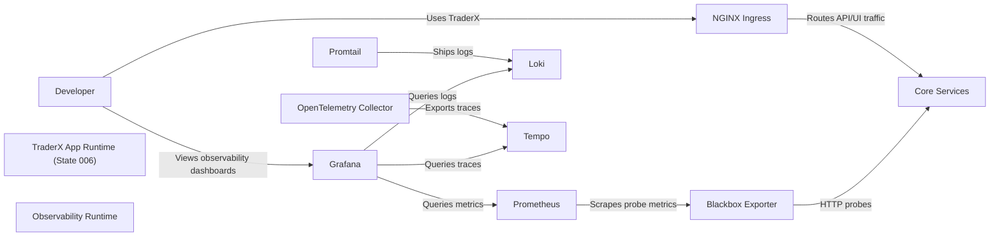

# Observability with LGTM on Compose

Containerized TraderX runtime (state 006) with an LGTM observability layer for local learning.

- Generated from: `system/architecture.model.json`
- Canonical flows: `system/end-to-end-flows.md`

## Architecture Diagram

## Node Catalog

| Node | Kind | Label | Notes |
| --- | --- | --- | --- |
| `developer` | actor | Developer | Local developer using this state. |
| `app_runtime` | boundary | TraderX App Runtime (State 006) | Baseline containerized TraderX services. |
| `obs_runtime` | boundary | Observability Runtime | LGTM + OTel stack for metrics/logs/traces. |
| `ingress` | service | NGINX Ingress | Edge entrypoint for UI and service proxy. |
| `core_services` | service | Core Services | Account, position, trade, processor, people, reference-data, nats-broker, database, UI. |
| `prometheus` | service | Prometheus | Scrapes probe and collector metrics. |
| `blackbox` | service | Blackbox Exporter | HTTP probe exporter for service availability/latency. |
| `loki` | service | Loki | Log aggregation backend. |
| `promtail` | service | Promtail | Docker log collector to Loki. |
| `tempo` | service | Tempo | Trace backend. |
| `otel` | service | OpenTelemetry Collector | OTLP ingest and telemetry routing. |
| `grafana` | service | Grafana | Unified dashboards for metrics, logs, traces. |

