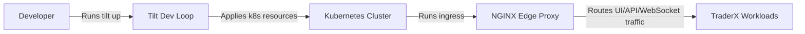

# Architecture (State 011 Tilt Local Dev on Kubernetes)

State 011 preserves state 010 Kubernetes runtime while introducing Tilt for local developer automation.

- Inherits architectural baseline from: `010-kubernetes-runtime`
- Generated from: `system/architecture.model.json`
- Canonical flows: `../001-baseline-uncontainerized-parity/system/end-to-end-flows.md`

## Entry Points

- `edge-proxy`: `http://localhost:8080`
- `tilt-ui`: `http://localhost:10350`

## Architecture Diagram

## Node Catalog

| Node | Kind | Label | Notes |
| --- | --- | --- | --- |
| `developer` | actor | Developer | Iterates locally with fast feedback loops. |
| `tilt` | tooling | Tilt Dev Loop | Build/deploy/log orchestration for local k8s. |
| `cluster` | boundary | Kubernetes Cluster | Underlying runtime substrate inherited from state 010. |
| `edge` | gateway | NGINX Edge Proxy | Single browser/API entrypoint. |
| `workloads` | service | TraderX Workloads | Core services remain functionally equivalent to state 010. |

## State Notes

- State 011 is the publish-lineage parent of state 012; state 013 branches from state 012.
- Primary delta is developer workflow/tooling, not platform abstraction.

