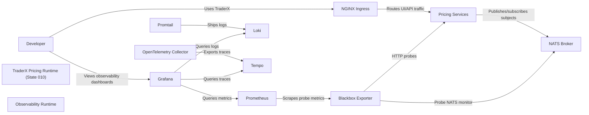

# Observability with LGTM on Pricing State

Pricing-aware TraderX runtime with LGTM observability and pricing-path probe coverage.

- Generated from: `system/architecture.model.json`
- Canonical flows: `system/end-to-end-flows.md`

## Architecture Diagram

## Node Catalog

| Node | Kind | Label | Notes |
| --- | --- | --- | --- |
| `developer` | actor | Developer | Local developer using this state. |
| `pricing_runtime` | boundary | TraderX Pricing Runtime (State 010) | Pricing-aware app services with NATS and price publisher. |
| `obs_runtime` | boundary | Observability Runtime | LGTM + OTel stack for metrics/logs/traces. |
| `ingress` | service | NGINX Ingress | Edge entrypoint for UI and APIs. |
| `pricing_services` | service | Pricing Services | Trade service, trade processor, position service, price publisher. |
| `nats` | service | NATS Broker | Realtime messaging for account and pricing subjects. |
| `prometheus` | service | Prometheus | Scrapes probe and collector metrics. |
| `blackbox` | service | Blackbox Exporter | HTTP probe exporter for app/pricing endpoints. |
| `loki` | service | Loki | Log aggregation backend. |
| `promtail` | service | Promtail | Docker log collector to Loki. |
| `tempo` | service | Tempo | Trace backend. |
| `otel` | service | OpenTelemetry Collector | OTLP ingest and telemetry routing. |
| `grafana` | service | Grafana | Dashboards for pricing + platform telemetry. |

