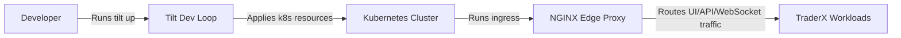

# Architecture (State 012 Platform Convergence C3)

State 012 is the C3 convergence checkpoint: Kubernetes + Tilt platform profile on top of C2 functional behavior.

- Inherits architectural baseline from: `011-tilt-kubernetes-dev-loop`
- Generated from: `system/architecture.model.json`
- Canonical flows: `../001-baseline-uncontainerized-parity/system/end-to-end-flows.md`

## Entry Points

- `edge-proxy`: `http://localhost:8080`
- `tilt-ui`: `http://localhost:10350`

## Architecture Diagram

## Node Catalog

| Node | Kind | Label | Notes |
| --- | --- | --- | --- |
| `developer` | actor | Developer | Iterates locally with fast feedback loops. |
| `tilt` | tooling | Tilt Dev Loop | Build/deploy/log orchestration for local k8s. |
| `cluster` | boundary | Kubernetes Cluster | Underlying runtime substrate inherited from state 011. |
| `edge` | gateway | NGINX Edge Proxy | Single browser/API entrypoint. |
| `workloads` | service | TraderX Workloads | Core services remain functionally equivalent to state 009 (C2), carried through state 012 lineage. |

## State Notes

- Publish lineage parent is state 011.
- Dotted-line convergence parent is state 009 (C2 functional convergence).
- State 012 marks C3 and is the recommended platform-ready baseline for subsequent work.

