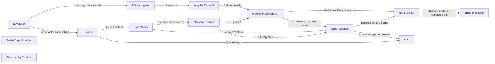

# Order Management and Matcher

Pricing + observability runtime extended with order management, matcher flow, and order-specific telemetry.

- Generated from: `system/architecture.model.json`
- Canonical flows: `system/end-to-end-flows.md`

## Architecture Diagram

## Node Catalog

| Node | Kind | Label | Notes |
| --- | --- | --- | --- |
| `developer` | actor | Developer | Local developer using this state. |
| `app_runtime` | boundary | TraderX App Runtime | State 012 pricing runtime with order-management extensions. |
| `obs_runtime` | boundary | Observability Runtime | LGTM + OTel stack from state 012 with order telemetry coverage. |
| `ingress` | service | NGINX Ingress | Routes UI, API, and order admin traffic. |
| `trade_ui` | service | Angular Trade UI | Trade ticket, blotters, and admin tab. |
| `order_api` | service | Order Management API | Order create/query/edit/cancel/force-fill endpoints. |
| `order_matcher` | service | Order Matcher | Matches open orders and emits order lifecycle + fill events. |
| `nats` | service | NATS Broker | Realtime transport for pricing, trade, position, and order subjects. |
| `trade_processor` | service | Trade Processor | Consumes fills and persists trades/positions. |
| `prometheus` | service | Prometheus | Scrapes order metrics and blackbox probes. |
| `blackbox` | service | Blackbox Exporter | Probes order endpoints and inherited runtime endpoints. |
| `loki` | service | Loki | Aggregates order and runtime logs. |
| `grafana` | service | Grafana | Dashboards for queue depth, open orders, events, and matcher latency. |

