# Architecture (State 013 Radius Platform on Kubernetes)

State 013 preserves state 012 C3 runtime while adding Radius application/resource abstractions.

- Inherits architectural baseline from: `012-platform-convergence-c3`
- Generated from: `system/architecture.model.json`
- Canonical flows: `../001-baseline-uncontainerized-parity/system/end-to-end-flows.md`

## Entry Points

- `edge-proxy`: `http://localhost:8080`

## Architecture Diagram

```mermaid
flowchart LR
  developer["Developer"]
  radius["Radius Control Plane"]
  appModel["Radius App Model"]
  cluster["Kubernetes Cluster"]
  edge["NGINX Edge Proxy"]
  workloads["TraderX Workloads"]
  developer -->|"Manages app model"| radius
  radius -->|"Resolves resources"| appModel
  appModel -->|"Deploys workloads"| cluster
  cluster -->|"Runs ingress"| edge
  edge -->|"Routes UI/API/WebSocket traffic"| workloads
```

## Node Catalog

| Node | Kind | Label | Notes |
| --- | --- | --- | --- |
| `developer` | actor | Developer | Operates platform/application definitions through Radius. |
| `radius` | platform | Radius Control Plane | Application-centric platform abstraction layer. |
| `appModel` | component | Radius App Model | Declarative app/resource definitions for TraderX. |
| `cluster` | boundary | Kubernetes Cluster | Underlying runtime substrate inherited from state 012. |
| `edge` | gateway | NGINX Edge Proxy | Single browser/API entrypoint. |
| `workloads` | service | TraderX Workloads | Core services remain functionally equivalent to state 012. |

## State Notes

- State 013 is an optional child branch of state 012.
- Primary delta is platform/deployment abstraction, not functional API behavior.

