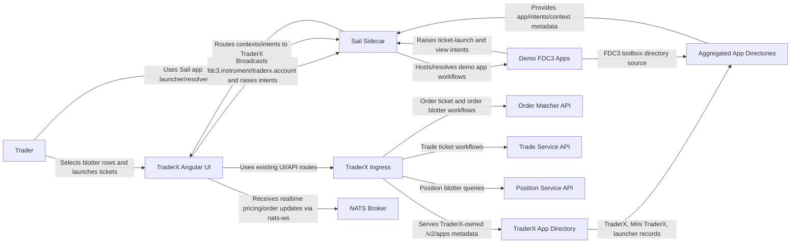

# FDC3 Intent Interoperability on C3

State 014 layers FDC3 context and intent interoperability onto the C3 TraderX runtime and adds a local Sail sidecar demo environment.

- Inherits architectural baseline from: `012-platform-convergence-c3`
- Generated from: `system/architecture.model.json`
- Canonical flows: `../001-baseline-uncontainerized-parity/system/end-to-end-flows.md`

## Entry Points

- `traderx-ui`: `http://localhost:8080`
- `mini-traderx`: `http://localhost:8080/mini-traderx`
- `sail-ui`: `http://localhost:8090`

## Architecture Diagram

## Node Catalog

| Node | Kind | Label | Notes |
| --- | --- | --- | --- |
| `trader` | actor | Trader | User interacting with TraderX blotters and tickets. |
| `traderxUi` | service | TraderX Angular UI | Trade/order/position views plus FDC3 integration adapter. |
| `traderxIngress` | gateway | TraderX Ingress | NGINX ingress for TraderX UI/API traffic. |
| `traderxDirectory` | component | TraderX App Directory | TraderX-owned FDC3 App Directory source for core TraderX, Mini TraderX, and TraderX Intent Launcher. |
| `sailSidecar` | service | Sail Sidecar | Local Sail desktop-agent runtime hosted outside TraderX ingress. |
| `sailDirectory` | component | Aggregated App Directories | Sail-consumed directory sources for TraderX-owned apps, FDC3 toolbox TradingView/Pricer demos, and FINOS conformance apps. |
| `demoApps` | service | Demo FDC3 Apps | Mini TraderX, local TraderX Intent Launcher, FDC3 toolbox TradingView/Pricer apps, and FINOS conformance apps participating in ticker/account workflows. |
| `orderApi` | service | Order Matcher API | Order listing and lifecycle endpoints used by order flows. |
| `tradeApi` | service | Trade Service API | Trade creation/query endpoints used by trade ticket flows. |
| `positionApi` | service | Position Service API | Position/blotter data source for symbol-selected rows. |
| `nats` | service | NATS Broker | Realtime ticker and lifecycle updates via websocket gateway. |

## State Notes

- FDC3 integration is additive and frontend-scoped.
- No backend API or schema changes are required for core interoperability behavior.
- Sail sidecar is intentionally outside TraderX ingress to keep concerns separated.
- TraderX-hosted App Directory metadata is intentionally behind TraderX ingress because it describes TraderX-owned apps and routes.
- Sail should aggregate app-directory sources rather than owning every app record locally.
- Degraded mode preserves baseline workflows when DesktopAgent is unavailable.
