# FDC3 Post-Trade DvP Settlement (TraderX ↔ BankerX)

State 016 completes the trading lifecycle: TraderX front-office execution dispatches standardized settlement instructions to BankerX (post-trade clearing & settlement) through FINOS FDC3 3.0.

- Inherits architectural baseline from: `012-platform-convergence-c3`
- Inherits interop baseline from: `014-fdc3-intent-interoperability`
- Canonical flows: `../001-baseline-uncontainerized-parity/system/end-to-end-flows.md`

## Entry Points

- `traderx-ui`: `http://localhost:8080` (Trade Blotter, `SETTLE (BANKERX)` action)
- `bankerx-terminal`: `https://terminal.synapticchain.xyz` (direct web dispatch fallback + settlement monitor)

## Architecture Diagram

```mermaid
flowchart LR
  trader["Trader"]
  traderxUi["TraderX Angular UI"]
  blotter["Trade Blotter (SETTLE action)"]
  desktopAgent["FDC3 Desktop Agent"]
  paymentCtx["fdc3.paymentContext (UETR-keyed)"]
  bankerx["BankerX Settlement Terminal"]
  guardian["ADR-555 Alcove Runtime Guardian"]
  rails["Trilateral Settlement Powerhouse"]
  pacs8["ISO 20022 pacs.008"]
  pacs2["ISO 20022 pacs.002 (Acsc)"]
  trader -->|"Confirms trade rows"| blotter
  blotter -->|"raiseIntent(StartPayment)"| desktopAgent
  desktopAgent -->|"Routes intent + context"| bankerx
  blotter -->|"No agent: fallback toast + direct dispatch"| bankerx
  paymentCtx -->|"Full ISO 20022-adjacent payload"| bankerx
  bankerx -->|"Pre-flight compliance (<8ms)"| guardian
  guardian -->|"Sanctions + solvency cleared"| rails
  rails -->|"Atomic settlement (Solana / XRPL / SYN)"| pacs8
  pacs8 -->|"Status report bound to UETR"| pacs2
  pacs2 -->|"Acsc confirmation"| desktopAgent
  desktopAgent -->|"Context listener: row SETTLED"| traderxUi
```

## Node Catalog

| Node | Kind | Label | Notes |
| --- | --- | --- | --- |
| `trader` | actor | Trader | Confirms trades and triggers settlement from the blotter. |
| `traderxUi` | service | TraderX Angular UI | Front-office execution views + settlement adapter (frontend-scoped). |
| `blotter` | component | Trade Blotter | Confirmed rows expose the `SETTLE (BANKERX)` action; rows mark `DISPATCHED`/`SETTLED`. |
| `desktopAgent` | service | FDC3 Desktop Agent | Optional; routes `StartPayment` intents and settlement-status contexts. |
| `paymentCtx` | component | fdc3.paymentContext | UETR-keyed context conforming to the FINOS `paymentContext` proposal (PR #2204). |
| `bankerx` | service | BankerX Settlement Terminal | Post-trade clearing: receives intents, validates, settles, reports. |
| `guardian` | component | Alcove Runtime Guardian | Pre-flight compliance: sanctions screening (Bloom, in-memory), solvency (Δ ≡ 0), <8ms. |
| `rails` | service | Trilateral Settlement Powerhouse | Solana Token-2022 (RequiredMemoTransfers) + XRPL Altnet (DENSE-16 SHAMap) + SynapticChain L1 (256-lane SMR). |
| `pacs8` | component | pacs.008 Generator | ISO 20022 credit transfer initiation bound to the RFC 4122 UUIDv4 UETR. |
| `pacs2` | component | pacs.002 Generator | ISO 20022 payment status report (`Acsc`) with on-chain transaction hash bindings. |

## State Notes

- Settlement dispatch is FDC3-first with a first-class degraded mode: no Desktop Agent means a non-blocking toast and direct web dispatch, never a dead button.
- TraderX stays crypto-free: all compliance and rail execution live in the BankerX tier.
- Backend TraderX services and schemas are unchanged; settlement status returns exclusively through FDC3 context listeners.
- The UETR is minted at dispatch time and is the join key across blotter row, pacs.008, rail settlement, and pacs.002 confirmation.