# FDC3 Post-Trade DvP Settlement (TraderX ↔ BankerX)

State 016 completes the trading lifecycle: TraderX front-office execution dispatches standardized settlement instructions to a post-trade settlement receiver through FINOS FDC3 3.0.

- Child state of: `014-fdc3-intent-interoperability` (014 stays the pristine FDC3 baseline; the settlement-specific runtime lives in 016's own overlay)
- Inherits architectural baseline from: `012-platform-convergence-c3`
- Canonical flows: `../001-baseline-uncontainerized-parity/system/end-to-end-flows.md`

## Receiver Variants (provider-neutral)

| Variant | Default | Description |
| --- | --- | --- |
| Local mock receiver | **yes** | `generation/mock-receiver/` — dependency-free FDC3 participant; request-to-outcome demo and tests reproducible offline; emits `synaptic.settlementStatus` |
| BankerX settlement terminal | opt-in | `https://terminal.synapticchain.xyz` — live multi-rail settlement engine behind the FDC3 boundary (XRPL TESTNET (altnet) / Solana DEVNET labels); swapped in via app-directory URL, no TraderX change |

## Entry Points

- `traderx-ui`: `http://localhost:8080` (Trade Blotter, `SETTLE (BANKERX)` action, rendered only when `findIntent('StartPayment')` resolves)
- `mock-receiver`: served from `generation/mock-receiver/index.html` (default receiver; declares `StartPayment` in its app-directory record)
- `bankerx-terminal`: `https://terminal.synapticchain.xyz` (direct web dispatch fallback + settlement monitor)

## Architecture Diagram

```mermaid
flowchart LR
  trader["Trader"]
  traderxUi["TraderX Angular UI"]
  blotter["Trade Blotter (findIntent-gated SETTLE action)"]
  desktopAgent["FDC3 Desktop Agent"]
  paymentCtx["fdc3.paymentContext (UETR-keyed)"]
  receiver["Settlement Receiver (mock = default / BankerX = reference)"]
  guardian["ADR-555 Alcove Runtime Guardian"]
  rails["Trilateral Settlement Powerhouse"]
  pacs8["ISO 20022 pacs.008"]
  pacs2["ISO 20022 pacs.002 (Acsc)"]
  trader -->|"Confirms trade rows"| blotter
  blotter -->|"findIntent(StartPayment) resolves -> render action"| desktopAgent
  blotter -->|"raiseIntent(StartPayment)"| desktopAgent
  desktopAgent -->|"Routes intent + context"| receiver
  blotter -->|"No agent: fallback toast + direct dispatch"| receiver
  paymentCtx -->|"Full ISO 20022-adjacent payload"| receiver
  receiver -->|"Validate + duplicate-dispatch guard"| guardian
  guardian -->|"Sanctions + solvency cleared"| rails
  rails -->|"Atomic settlement (Solana / XRPL / SYN)"| pacs8
  pacs8 -->|"Status report bound to UETR"| pacs2
  pacs2 -->|"synaptic.settlementStatus (Acsc / Rjct / Pndg)"| desktopAgent
  desktopAgent -->|"Context listener: row SETTLING→SETTLED/REJECTED"| traderxUi
```

## Node Catalog

| Node | Kind | Label | Notes |
| --- | --- | --- | --- |
| `trader` | actor | Trader | Confirms trades and triggers settlement from the blotter. |
| `traderxUi` | service | TraderX Angular UI | Front-office execution views + settlement adapter (frontend-scoped, 016 overlay). |
| `blotter` | component | Trade Blotter | `SETTLE (BANKERX)` action appears only when `findIntent('StartPayment')` resolves; rows flip `SETTLING…` / `SETTLED` / `REJECTED`; duplicate dispatch suppressed. |
| `desktopAgent` | service | FDC3 Desktop Agent | Optional; routes `StartPayment` intents, resolves participant capability, relays settlement-status contexts. |
| `paymentCtx` | component | fdc3.paymentContext | UETR-keyed context conforming to the FINOS `paymentContext` proposal (PR #2204). |
| `receiver` | service | Settlement Receiver | Provider-neutral: local mock receiver (default) or BankerX terminal. Validates, dedupes by UETR, settles, reports honestly. |
| `guardian` | component | Alcove Runtime Guardian | Pre-flight compliance (BankerX variant only): sanctions screening (Bloom, in-memory), solvency (Δ ≡ 0), sub-8ms. |
| `rails` | service | Trilateral Settlement Powerhouse | Solana Token-2022 (RequiredMemoTransfers) + XRPL Altnet (DENSE-16 SHAMap) + SynapticChain L1 (256-lane SMR); BankerX variant only. |
| `pacs8` | component | pacs.008 Generator | ISO 20022 credit transfer initiation bound to the RFC 4122 UUIDv4 UETR (BankerX variant). |
| `pacs2` | component | pacs.002 Generator | ISO 20022 payment status report (`Acsc`/`Rjct`/`Pndg`) with on-chain transaction hash bindings (BankerX variant). |

## Overlay Layout (specs/016-post-trade-settlement-bankerx/generation/)

- `frontend-overrides/web-front-end/angular/main/app/service/fdc3-interop.service.ts` — 014 baseline + `StartPayment` dispatch, `findIntent` discovery, UETR dispatch tracking, `synaptic.settlementStatus` listener.
- `frontend-overrides/web-front-end/angular/main/app/trade/trade-blotter/trade-blotter.component.ts` — 014 baseline + findIntent-gated action column, status correlation, duplicate-dispatch guard.
- `mock-receiver/` — local mock receiver: `index.html`, provider-neutral `payment-lifecycle.mjs`, app-directory fragment (`appd/mock-receiver.appd.json`), receiver-registration README.
- `generation-hook.md` — overlay model + future state-ification steps.

## State Notes

- The SETTLE action is capability-discovered, never configured: no post-trade participant in the workspace means no action column (pristine 014 blotter).
- Settlement status is distinct from trade status: rows flip `SETTLING…` → `SETTLED` / `REJECTED` on a matching-UETR status broadcast; unmatched reports are logged, never applied.
- TraderX keeps only session-scoped dispatch state (UETR, row correlation); no persistence, no schema or migration changes.
- TraderX stays crypto-free: all compliance and rail execution live behind the FDC3 boundary (BankerX variant).